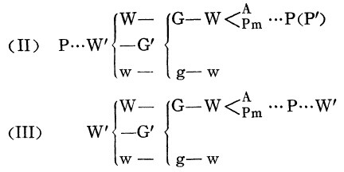

中文马克思主义文库 -\> [马克思](https://www.marxists.org/chinese/marx/index.htm)
- [恩格斯](https://www.marxists.org/chinese/engels/index.htm) -\>
[《马克思恩格斯全集》第二十四卷](https://www.marxists.org/chinese/marx-engels/24/index.htm)

第四章 循环过程的三个公式

| · [自然经济、货币经济和信用经济](https://www.marxists.org/chinese/marx-engels/24/006.htm#1) · [需求和供给相抵](https://www.marxists.org/chinese/marx-engels/24/006.htm#2) |
|---------------------------------------------------------------------------------------------------------------------------------------------------------------------------|

  
  
如果用Ｃｋ代表总流通过程，这三个公式可以表示如下：

| （Ⅰ）Ｇ—Ｗ…Ｐ…Ｗ′—Ｇ′  （Ⅱ）Ｐ…Ｃｋ…Ｐ  （Ⅲ）Ｃｋ…Ｐ（Ｗ′）。  |
|----------------------------------------------------------------|

如果我们对这三个形式进行总的考察，那末，过程的所有前提都表现为过程的结果，表现为过程本身所产生的前提。每一个因素都表现为出发点、经过点和复归点。总过程表现为生产过程和流通过程的统一；生产过程成为流通过程的媒介，反之亦然。  
所有这三个循环都有一个共同点：价值增殖是决定目的，是动机。在形式Ⅰ中，这一点已经在形式上表现出来了。形式Ⅱ是以Ｐ即价值增殖过程本身开始的。在形式Ⅲ中，即使运动以同样规模反复进行，循环也是以已经增殖的价值开始，而以重新增殖的价值结束的。  
就Ｗ—Ｇ从买者方面看是Ｇ—Ｗ，Ｇ—Ｗ从卖者方面看是Ｗ—Ｇ来说，资本的流通只是表示普通的商品形态变化，而我们在考察这个形态变化时（第1卷第3章第2节）阐明的关于货币流通量的规律在这里也是适用的。但是，如果我们不是停留在这个形式方面，而是考察不同的单个资本的形态变化的实际联系，就是说，如果我们把各单个资本的循环作为社会总资本的再生产过程的部分运动来实际地考察它们的联系，那末，这种联系就不能用货币和商品的单纯形式变换来说明了。  
在一个不断回转的循环中，每一点都同时是出发点和复归点。如果把这种回转中断，那就不是每一个出发点都是复归点了。我们已经知道，不仅每一个特殊的循环都把其他的循环作为前提（包含在内），而且一种形式的循环的反复，已经包含着其他形式的循环的进行。因此，全部区别表现为单纯形式上的区别，或者说，表现为单纯主观上的、只对考察者才存在的区别。  
如果把任何一种循环都看作不同的单个产业资本所处的特殊的运动形式，那末，这种区别也始终只是作为一种个别的区别而存在。但是实际上，任何一个单个产业资本都是同时处在所有这三种循环中。这三种循环，三种资本形态的这些再生产形式，是连续地并列进行的。例如，现在作为商品资本执行职能的资本价值的一部分，转化为货币资本，但同时另一部分则离开生产过程，作为新的商品资本进入流通。因此，Ｗ′…Ｗ′循环形式不断地进行着；其他两个形式也是如此。资本在它的任何一种形式和任何一个阶段上的再生产都是连续进行的，就象这些形式的形态变化和依次经过这三个阶段是连续进行的一样。可见，在这里，总循环是它的三个形式的现实的统一。  
我们的考察曾经假定，资本价值是按照它的价值总量全部作为货币资本，或作为生产资本，或作为商品资本出现的。例如，我们假定422镑首先是全部作为货币资本，然后全部转化为生产资本，最后又全部作为商品资本，即价值500镑（其中有78镑剩余价值）的纱。在这里，各个不同阶段会分别形成中断。例如，当422镑保持货币形式时，也就是说，在购买行为Ｇ—Ｗ（Ａ＋Ｐｍ）完成以前，全部资本只是作为货币资本存在并执行职能。一旦它转化为生产资本，它就既不作为货币资本，也不作为商品资本执行职能了。它的全部流通过程就会中断，另一方面，一旦它处在两个流通阶段的一个阶段上，不论是作为Ｇ还是作为Ｗ′执行职能，它的全部生产过程也同样就会中断。这样一来，Ｐ…Ｐ循环不仅表现为生产资本的周期更新，而且在流通过程完成以前，同样表现为它的职能即生产过程的中断；生产将不是连续地进行，而将发生间断，只有经过一段由流通过程的这两个阶段完成得快慢所决定的长短不定的时间，生产才能重新进行。例如，中国的手工业者就是这样，他只是为私人顾客劳动，如果没有新的订货，他的生产过程就会停顿。  
实际上，以上所说适用于处在运动中的资本的每一个部分，并且资本的所有部分都要依次经过这种运动。假定10000磅纱是一个纺纱业主的一周的产品。这10000磅纱要全部从生产领域转到流通领域；其中包含的资本价值必须全部转化为货币资本，并且只要资本价值保持货币资本的形式，它就不能重新进入生产过程；它必须先进入流通，并重新转化为生产资本的要素Ａ＋Ｐｍ。资本的循环过程是不断的中断，是离开一个阶段，进入下一个阶段；是抛弃一种形式，存在于另一种形式；其中每一个阶段不仅以另一个阶段为条件，而且同时排斥另一个阶段。  
但是，连续性是资本主义生产的特征，是由资本主义生产的技术基础所决定的，虽然这种连续性并不总是可以无条件地达到的。让我们来看看实际情况是怎样的。例如，在10000磅纱作为商品资本进入市场，并转化为货币（不论是支付手段，还是购买手段，甚至只是计算货币）时，新的棉花、煤炭等等则代替纱出现于生产过程，也就是说，已经由货币形式和商品形式重新转化为生产资本的形式，从而开始执行生产资本的职能；在第一个10000磅纱转化为货币的同时，以前的10000磅纱则已经进行它的流通的第二阶段，由货币重新转化为生产资本的要素。资本的所有部分都依次经过循环过程，而同时处在循环过程的不同阶段上。这样，产业资本在它的循环的连续进行中，就同时处在它的一切循环阶段以及和各该阶段相适应的不同的职能形式上。对第一次由商品资本转化为货币的部分来说，Ｗ′…Ｗ′循环才开始，而对作为运动中的整体的产业资本来说，Ｗ′…Ｗ′循环则已经完成。货币是一手预付出去，另一手收进来。Ｇ…Ｇ′循环在一点上的开始，同时就是它在另一点上的复归。生产资本也是如此。  
因此，产业资本的连续进行的现实循环，不仅是流通过程和生产过程的统一，而且是它的所有三个循环的统一。但是，它之所以能够成为这种统一，只是由于资本的每个不同部分能够依次经过相继进行的各个循环阶段，从一个阶段转到另一个阶段，从一种职能形式转到另一种职能形式，因而，只是由于产业资本作为这些部分的整体同时处在各个不同的阶段和职能中，从而同时经过所有这三个循环。在这里，每一部分的相继进行，是由各部分的并列存在即资本的分割所决定的。因此，在实行分工的工厂体系内，产品不断地处在它的形成过程的各个不同阶段上，同时又不断地由一个生产阶段转到另一个生产阶段。因为单个产业资本代表着一定的量，而这个量又取决于资本家的资金，并且对每个产业部门来说都有一定的最低限量，所以单个产业资本的分割必须按一定的比例数字进行。现有资本的量决定生产过程的规模，而生产过程的规模又决定同生产过程并列执行职能的商品资本和货币资本的量。但是，决定生产连续性的并列存在之所以可能，只是由于资本的各部分依次经过各个不同阶段的运动。并列存在本身只是相继进行的结果。例如，如果对资本的一部分来说Ｗ′—Ｇ′停滞了，商品卖不出去，那末，这一部分的循环就会中断，它的生产资料的补偿就不能进行；作为Ｗ′继续从生产过程中出来的各部分，在职能变换中就会被它们的先行部分所阻止。如果这种情况持续一段时间，生产就会受到限制，整个过程就会停止。相继进行一停滞，就使并列存在陷于混乱。在一个阶段上的任何停滞，不仅会使这个停滞的资本部分的总循环，而且会使整个单个资本的总循环发生或大或小的停滞。  
过程采取的下一个形式，是各个阶段相继进行的形式，因而，资本过渡到一个新阶段，是由它离开另一个阶段所决定的。因此，每一个特殊循环都有资本的一种职能形式作为它的出发点和复归点。另一方面，总过程实际上又是三个循环的统一，这三个循环是过程的连续性借以表现的不同形式。总循环对资本的每一种职能形式来说，都表现为它的特殊的循环，并且每一个这种循环都决定着总过程的连续性；一种职能形式的循环决定着另一种职能形式的循环。总生产过程同时就是再生产过程，从而是总生产过程的每一个要素的循环——这对总生产过程来说，特别是对社会资本来说，是一个必要的条件。资本的各个不同部分依次经过各个不同的阶段和职能形式。因此，每一种职能形式虽然其中表现出来的总是资本的另一个部分，但都和其他职能形式同时经过它自己的循环。资本的一部分，一个不断变动、不断再生产出来的部分，作为要转化为货币的商品资本而存在；另一部分作为要转化为生产资本的货币资本而存在；第三部分则作为要转化为商品资本的生产资本而存在。所有这三种形式的经常存在，正是由总资本经过这三个阶段的循环而引起的。  
因此，资本作为整体是同时地、在空间上并列地处在它的各个不同阶段上。但是，每一个部分都不断地依次由一个阶段过渡到另一个阶段，由一种职能形式过渡到另一种职能形式，从而依次在一切阶段和一切职能形式中执行职能。因此，这些形式都是流动的形式，它们的同时并列，是由于它们的相继进行而引起的。每一种形式都跟随在另一种形式之后，而又发生在它之前，因而，一个资本部分回到一种形式，是由另一个部分回到另一种形式而决定的。每一个部分都不断进行着它自己的循环，然而总是资本的另一个部分处在这种形式中，而这些特殊的循环只是形成总过程的各个同时存在而又依次进行的要素。  
只有在三个循环的统一中，才能实现总过程的连续性，而不致发生上述的中断。社会总资本始终具有这种连续性，而它的过程始终是三个循环的统一。  
就各个单个资本来说，再生产的连续性有时或多或少地会发生中断。第一，价值总量在不同的时期往往以不等的部分分配在各个不同阶段和职能形式中。第二，这些部分可以按照所生产的商品的性质，即按照资本投入的特殊的生产领域，进行不同的分配。第三，在有季节性的生产部门，不论是由于自然条件（如农业、捕鲱鱼等），还是由于习惯（例如在所谓季节劳动上），连续性可能或多或少地发生中断。在工厂和矿山中，过程是最规则地、最划一地进行的。但是，各生产部门之间的这种差别，不会引起循环过程的一般形式的差别。  
资本作为自行增殖的价值，不仅包含着阶级关系，包含着建立在劳动作为雇佣劳动而存在的基础上的一定的社会性质。它是一种运动，是一个经过各个不同阶段的循环过程，这个过程本身又包含循环过程的三种不同的形式。因此，它只能理解为运动，而不能理解为静止物。那些把价值的独立性看作是单纯抽象的人忘记了，产业资本的运动就是这种抽象的实现。在这里，价值经过不同的形式，不同的运动，在其中它保存自己，同时使自己增殖，增大。因为我们在这里研究的首先是单纯的运动形式，所以对资本价值在它的循环过程中可能发生的革命就不去考虑了；但是很明显，尽管发生各种价值革命，资本主义生产只有在资本价值增殖时，也就是在它作为独立价值完成它的循环过程时，因而只有在价值革命按某种方式得到克服和抵销时，才能够存在和继续存在。资本的运动所以会表现为产业资本家个人的行动，是因为他作为商品和劳动的买者，作为商品的卖者和作为生产的资本家执行职能，因而通过他的活动来促成这种循环。如果社会资本的价值发生价值革命，他个人的资本就可能受到这一革命的损害而归于灭亡，因为它已经不能适应这个价值运动的条件。价值革命越是尖锐，越是频繁，独立价值的那种自动的、以天然的自然过程的威力来发生作用的运动，就越是和资本家个人的先见和打算背道而驰，正常的生产过程就越是屈服于不正常的投机，单个资本的存在就越是要冒巨大的危险。因此，这些周期性的价值革命证实了它们似乎应该否定的东西，即证实了价值作为资本所获得的、通过自身的运动而保持和加强的独立性。  
处在过程中的资本的这个形态变化序列，包含着在循环中变化了的资本价值量和原有价值的不断比较。如果说价值对于形成价值的力量即劳动力的独立性是在Ｇ—Ａ行为（劳动力的购买）中开始的，并在剥削劳动力的生产过程中实现的，那末，价值的这种独立性就没有在这个循环中再表现出来，在这个循环中，货币、商品和生产要素只是处在过程中的资本价值的互相交替的形式，过去的价值量是和现在的已经变化的资本价值量相比较的。  
贝利否定作为资本主义生产方式特征的价值独立性，而把它看作是某些经济学家的幻想，他说：

“价值是同时存在的各商品之间的关系，因为只有这样的商品能够互相交换”[29]。

他这样说，是为了反对对不同时期的商品价值进行比较，这种比较，只要把每个时期的货币价值固定下来，就仅仅是在不同时期为生产同一种商品所需要的劳动消耗的比较。他的这种看法是由他的总的误解产生的。他认为，交换价值＝价值，价值形式就是价值本身；因此，如果商品价值不是能动地作为交换价值执行职能，从而在实际上不能互相交换，那末，它们就是不能互相比较的。这样，他就丝毫没有觉察到，只有价值在自己循环的不同阶段（决不是同时存在的，而是相继进行的）保持着它自身的同一性，并且和它自身进行比较，它才作为资本价值或资本执行职能。  
为了纯粹地考察循环公式，仅仅假定商品按照价值出售是不够的，还必须假定这是在其他条件不变的情况下进行的。以Ｐ…Ｐ形式为例，我们把生产过程范围内会使某个资本家的生产资本贬值的一切技术革命撇开不说；把生产资本的各种价值要素的变动对现有商品资本价值所产生的一切反作用（如果有商品资本的储备，它的价值会因此提高或降低）也撇开不说。假定Ｗ′，10000磅纱，按照它的价值500镑出售了；8440磅＝422镑，补偿Ｗ′所包含的资本价值。但是，如果棉花、煤炭等等的价值提高了（我们这里把单纯的价格波动撇开不说），那末，要全部补偿生产资本的要素，这422镑也许就不够了，而必须有追加的货币资本，货币资本就被束缚起来。如果这些东西的价格跌落了，情况就会相反，货币资本就被游离出来。只有在价值关系保持不变时，过程才能完全正常地进行；只有各种干扰在循环反复中被排除，过程才能够在事实上正常进行；干扰越大，产业资本家就必须持有越是大量的货币资本，才有可能排除干扰；因为随着资本主义生产的进展，每一单个生产过程的规模会扩大，预付资本的最低限量也会随之增加，所以除了其他情况外，又加上这个情况，使产业资本家的职能越来越转化为各自独立或互相结合的大货币资本家的垄断。  
这里要附带指出：生产要素的价值一有变动，Ｇ…Ｇ′形式同Ｐ…Ｐ和Ｗ′…Ｗ′形式之间就会显示出差别。  
在Ｇ…Ｇ′这一最初作为货币资本出现的、新投入的资本的公式中，如果原料、辅助材料等等生产资料的价值降低了，那末，开办一个具有一定规模的企业需要花费的货币资本，就会比价值降低以前少，因为生产过程的规模（在生产力的发展不变的情况下）取决于一定量劳动力所能掌握的生产资料的数量和规模，而不是取决于这种生产资料的价值，也不是取决于劳动力的价值（劳动力的价值只会影响价值增殖的量）。反过来说，如果形成生产资本要素的商品的生产要素的价值提高了，那末，开办一个具有这样规模的企业，就需要较多的货币资本。在这两个场合，受影响的只是新要投入的货币资本的量；如果新的单个产业资本的增加在某一生产部门是按照通常的方式进行的，在第一个场合，货币资本就会过剩，在第二个场合，货币资本就会被束缚。  
Ｐ…Ｐ和Ｗ′…Ｗ′循环，只有在Ｐ和Ｗ′的运动同时就是积累时，也就是说，只有在追加的货币ｇ转化为货币资本时，才表现为Ｇ…Ｇ′。如果撇开这点不说，生产资本的要素的价值变动对上述两个循环的影响，就会不同于对Ｇ…Ｇ′的影响。在这里，我们再把这种价值变动对于已经处在生产过程中的资本的组成部分的反作用撇开不说。在这里，受到直接影响的，不是原来花费的资本，而是处在再生产过程中、不是处在第一次循环中的产业资本，因而是Ｗ′…

，即商品资本向它的由商品组成的生产要素的再转化。在价值降低（或价格降低）时，可能有三种情况：再生产过程以相同的规模继续进行，这时，原有货币资本的一部分被游离出来，从而发生了货币资本的积累，但没有发生现实的积累（规模扩大的生产），即没有发生先于和伴随这种积累的由ｇ（剩余价值）到积累基金的转化；或者是再生产过程以大于过去的规模扩大，如果技术的比例允许这样做；或者是原料等等有较大的储备。  
在补偿商品资本的要素的价值提高时，情况则相反。这时，再生产就不能再以正常的规模进行（例如工作时间会缩短）；或者为了维持原有的规模，就必须使用追加的货币资本（货币资本的束缚）；或者如果有积累的货币基金，那它就全部或部分地用来维持原有规模的经营，而不是用来扩大再生产过程。这也是货币资本的束缚，不过在这里，追加的货币资本不是来自外部，来自货币市场，而是来自产业资本家自己的资金。  
但是，在Ｐ…Ｐ和Ｗ′…Ｗ′中，可能发生会引起变化的情况。例如，我们的棉纺业主存有大量棉花（就是说，他的生产资本的一大部分是棉花储备），他的生产资本的一部分就会因棉花价格跌落而贬值，相反，在棉花价格上涨时，他的生产资本的这个部分的价值就会提高。另一方面，如果他把大量资本固定在商品资本的形式上，例如固定在棉纱上，那末在棉花跌价时，他的商品资本的一部分，从而一般来说，他的处在循环中的资本的一部分就会贬值。在棉花价格上涨时，情况则相反。最后，在Ｗ′—

过程中会发生如下的情况：如果Ｗ′—Ｇ即商品资本的实现发生在Ｗ的要素的价值变动之前，那末，资本就只会按照第一种情况中所考察的方式受到影响，也就是在第二流通行为

中受到影响；但是，如果价值变动发生在Ｗ′—Ｇ完成之前，那末在其他条件不变的情况下，棉花价格的跌落就会引起棉纱价格相应的跌落，反之，棉花价格的上涨就会引起棉纱价格的上涨。投入同一生产部门的不同的单个资本所处的情况不同，它们所受的影响也可以极不相同。——货币资本的游离和束缚，同样可以由流通过程持续时间不同，也就是由流通速度不同引起。但是，这是在考察周转时所要研究的问题。我们这里关心的，只是在生产资本的要素的价值变动时Ｇ…Ｇ′和循环过程其他两个形式之间所显示的实际区别。  
在资本主义生产方式已经发展，已经占统治地位的时代，在

流通阶段中，构成生产资料Ｐｍ的商品的很大一部分本身是别人的执行职能的商品资本。因此，从卖者的观点来看，就发生了Ｗ′—Ｇ′，即商品资本转化为货币资本。但是，这并不是绝对的。相反，在产业资本或者作为货币或者作为商品执行职能的流通过程内，产业资本不论作为货币资本还是作为商品资本的循环，是和各种不同的社会生产方式的商品流通交错在一起的，只要这些生产方式同时是商品生产。不论商品是建立在奴隶制基础上的生产的产品，还是农民的产品（中国人，印度的农奴），还是公社的产品（荷属东印度），还是国家生产的产品（如从前在俄罗斯历史上出现的以农奴制为基础的国家生产），还是半开化的狩猎民族的产品等等，它们总是作为商品和货币，同表现产业资本的货币和商品相对立，既进入产业资本的循环，在剩余价值作为收入花掉时，也进入商品资本所包含的剩余价值的循环，也就是说，进入商品资本的两个流通部门。作为它们来源的生产过程的性质如何是没有关系的；它们作为商品在市场上执行职能，作为商品进入产业资本的循环和商品资本所包含的剩余价值的流通。因此，商品来源的全面性，市场作为世界市场而存在，是产业资本流通过程的特点。以上就外国商品而言的，也同样适用于外国货币。正象商品资本对外国货币只是执行商品职能一样，外国货币对商品资本也只是执行货币职能；在这里，货币是执行世界货币的职能。  
但是，这里必须指出两点。  
第一，Ｇ—Ｐｍ行为一旦完成，商品（Ｐｍ）就不再是商品了，而成为产业资本在它作为生产资本Ｐ的职能形式上的存在方式之一。但是，商品的来源因此也就消失了；它们只是作为产业资本的存在形式而存在，并且合并到产业资本中去。不过，为了补偿它们，就必须再生产它们，就这一点来说，资本主义生产方式受到在它的发展阶段以外的生产方式的制约。但是，它的趋势是尽可能使一切生产转化为商品生产；它实现这种趋势的主要手段，正是把一切生产卷入它的流通过程；而发达的商品生产本身就是资本主义的商品生产。产业资本的侵入，到处促进这种转化，同时又促使一切直接生产者转化为雇佣工人。  
第二，进入产业资本流通过程的商品（也包括可变资本在付给工人之后为了再生产劳动力而转化成的必要的生活资料），不管其来源如何，不管生产它们的生产过程的社会形式如何，已经以商品资本的形式，以商业资本或商人资本的形式，出现在产业资本面前；商业资本，按它的性质来说，包括一切生产方式的商品。  
资本主义生产方式以大规模的生产为前提，同样也必须以大规模的出售为前提；因此是以出售给商人，而不是出售给消费者个人为前提。如果这种消费者自己就是生产消费者，是产业资本家，也就是说，如果一个生产部门的产业资本为其他生产部门提供生产资料，那末，也会发生一个产业资本家（以订货等形式）直接出售给其他许多产业资本家的情况。如果是这样，每个产业资本家就是直接的出售者，就是自己的商人；在出售给商人的时候，也是这样。  
作为商人资本的职能的商业，是资本主义生产的前提，并且随着资本主义生产的发展而日益发展。因此，我们在解释资本主义流通过程的某些方面时，有时假定商业存在，但在对资本主义流通过程作一般分析时，我们假定是直接出售，没有商人作中介，因为商人的中介会把运动的各种因素隐蔽起来。  
我们来看看西斯蒙第，他对这个问题的说明有些天真：

“商业动用的资本是相当可观的，但乍一看来似乎并不构成我们曾详细论述其运动的资本的任何部分。在呢绒商栈房中堆积的呢绒的价值，初看起来似乎和年生产中富者为使贫者劳动而付给贫者的工资部分无关。然而，这种资本只是补偿我们前面讲的另一个资本。为了清楚地理解财富的发展，我们已经从财富的创造一直谈到财富的消费。例如，生产呢绒所用的资本在我们看来总是一样的；在和消费者的收入进行交换时，它只是分成两个部分：一部分以利润的形式，成了工厂主的收入，另一部分则以工人生产新呢绒时的工资的形式，成了工人的收入。  
但是，我们立即发现，为了大家的利益，最好使这个资本的各个不同部分可以互相补偿，假如10万埃巨足以保证工厂主和消费者之间的全部流通，最好把这10万埃巨在工厂主、批发商和零售商之间平分。工厂主只要拥有三分之一的资本，就能进行他拥有全部资本时才能进行的活动，因为他现在把产品制造出来以后，可以比他寻找消费者时快得多地找到商人来购买。批发商的资本也可以快得多地用零售商的资本来补偿……预付的工资总额和最后消费者的购买价格之间的差额，应成为资本的利润。自从工厂主、批发商和零售商分别执行他们的职能以来，这种利润就在他们中间进行分配了，而完成的工作是一样的，虽然需要三个人，而不是一个人，需要三个资本部分，而不是一个资本”（《政治经济学新原理》第1卷第139、140页）。——“一切〈商人〉都是间接参加生产；因为，既然生产的目的是消费，那就只有在把产品送到消费者手里之后，生产才能算完成”（同上，第137页）。

在考察循环的一般形式时，总的说来，在这整个第二卷中，我们所说的货币，是指金属货币，不包括象征性的货币，单纯的价值符号（只是某些国家所特有的东西）和尚未阐明的信用货币。第一，这是历史的进程；在资本主义生产的初期，信用货币还不起作用或只起很小的作用。第二，这个进程的必然性，在理论上由以下的事实得到了证明：图克等人过去对信用货币的流通所作的一切批判性的说明，迫使他们不得不再三回过去考察在单纯金属流通的基础上事情是什么样的。但是，我们不要忘记，金属货币既能执行购买手段的职能，也能执行支付手段的职能。为了简便起见，我们在这第二卷中一般只谈它的前一种职能形式。  
只是作为产业资本单个循环过程的一部分的产业资本的流通过程，如果只代表一般商品流通范围内的一个行为序列，那它是由以前（第1卷第3章）已经阐明的一般规律所决定的。货币的流通速度越大，也就是说，每个单个资本经过它的商品或货币的形态变化序列越快，同一货币量（比如500镑）就越是使更多的产业资本（或商品资本形式的单个资本）相继进入流通。因此，货币越是作为支付手段执行职能，也就是说，例如，在一个商品资本由它的生产资料补偿时越是只需要支付抵账后的差额，支付期（例如工资的支付期）越短，同量资本价值的流通所需要的货币量就会越小。另一方面，假定流通速度和其他一切条件不变，必须作为货币资本流通的货币量，就由商品的价格总额（价格乘商品总量）决定，或者，假定商品的总量和价值已定，就由货币本身的价值决定。  
但是，一般商品流通的规律，只有在资本流通过程形成简单流通行为的序列时，才是适用的，而在简单流通行为的序列形成单个产业资本循环的职能上确定的阶段时，却是不适用的。  
为了清楚地说明这一点，我们最好考察具有不间断联系的流通过程，这样的流通过程表现为以下两个形式：  
  

  
作为一般的流通行为的序列，流通过程（不论是Ｗ—Ｇ—Ｗ，还是Ｇ—Ｗ—Ｇ）只是代表商品形态变化的两个相反的序列，其中每一个形态变化又包含着别人的商品或和商品相对立的别人的货币方面的相反的形态变化。  
商品所有者方面的Ｗ—Ｇ就是买者方面的Ｇ—Ｗ；商品在Ｗ—Ｇ中的第一形态变化，就是表现为Ｇ的商品的第二形态变化。在Ｇ—Ｗ中则适得其反。因此，既然资本家执行商品的买者和卖者的职能，从而他的资本对别人的商品来说执行货币的职能，或者对别人的货币来说执行商品的职能，那末，关于一个商品在一个阶段上的形态变化和另一个商品在另一个阶段上的形态变化的交错所作的说明，对于资本流通也是适用的。但是，这种交错并非同时就是资本的形态变化交错的表现。  
第一，我们知道，Ｇ—Ｗ（Ｐｍ）可以代表不同单个资本的形态变化的交错。例如，棉纱业主的商品资本棉纱有一部分要由煤炭来补偿。他的资本的一部分处于货币形式，要由货币形式转化为商品形式，而生产煤炭的资本家的资本却处于商品形式，因而要转化为货币形式；同一个流通行为在这里表示两个（属于不同生产部门的）产业资本的相反的形态变化，也就是表示这两个资本的形态变化序列的交错。但是，我们知道，Ｇ转化成的Ｐｍ，不必是绝对意义上的商品资本，也就是说，不必是产业资本的职能形式，不必是资本家生产出来的东西。这里总是一方面的Ｇ—Ｗ，另一方面的Ｗ—Ｇ，但并不总是资本形态变化的交错。其次，Ｇ—Ａ，劳动力的购买，决不是资本形态变化的交错，因为劳动力固然是工人的商品，但只有卖给了资本家，才变为资本。另一方面，在Ｗ′—Ｇ′过程中，Ｇ′不必是转化了的商品资本；它可以是商品劳动力转化成的货币（工资），或者是独立劳动者、奴隶、农奴或公社所生产的产品转化成的货币。  
第二，即使我们假定世界市场的全部生产都是按资本主义方式经营的，对于在一个单个资本流通过程内发生的任何形态变化所起的职能上确定的作用来说，也决不要求这种形态变化在另一个资本的循环上代表相应的相反形态变化。例如，在Ｐ…Ｐ循环中，Ｗ′转化成的货币Ｇ′，从买者方面看，可以只是他的剩余价值转化成的货币（如果商品是消费品）；或者在Ｇ′—

中（因而，这里进入的是已积累的资本），对Ｐｍ的卖者来说，Ｇ′可以仅仅作为他的预付资本的补偿而进入他的资本流通，或者它可以作为收入花掉而根本不再进入他的资本流通。  
因此，社会总资本——单个资本在社会总资本中只是独立执行职能的组成部分——的各个不同组成部分在流通过程中怎样互相补偿的问题（无论说的是资本还是剩余价值），不能从商品流通的简单的形态变化的交错得到说明，这种交错是资本流通行为和其他一切商品流通所共有的，这里需要用另一种研究方式。在这个问题上，直到现在为止人们还是满足于使用一些空洞的词句，只要仔细分析一下，这些词句不过是包含一些不确定的观念，这些观念只是从一切商品流通所具有的形态变化交错中套用来的。  

  
  
产业资本循环过程从而资本主义生产的最明显的特征之一就是：一方面，生产资本的形成要素必须来自商品市场，并且不断从这个市场得到更新，作为商品买进来；另一方面，劳动过程的产品则作为商品从劳动过程产生出来，并且必须不断作为商品重新卖出去。例如，我们把苏格兰低地的现代租地农场主和欧洲大陆的旧式小农比较一下。前者出售他的全部产品，因而必须在市场上补偿它的全部要素，甚至包括种子；后者则是直接消费他的产品的绝大部分，尽量少买少卖，只要有可能，就自己造工具、做衣服等等。  
据此，人们把自然经济、货币经济和信用经济作为社会生产的三个具有特征的经济运动形式而互相对立起来。  
第一，这三个形式并不代表对等的发展阶段。所谓信用经济本身只是货币经济的一种形式，因为这两个名词都表示生产者自身间的交易职能或交易方式。在发达的资本主义生产中，货币经济只表现为信用经济的基础。因此，货币经济和信用经济只适应于资本主义生产的不同发展阶段，但决不是和自然经济对立的两种不同的独立的交易形式。人们根据同样的理由，似乎也可以把自然经济的各种极不相同的形式，作为对等的东西，和这两种经济对立起来。  
第二，因为人们在货币经济和信用经济这两个范畴上强调的并且作为特征提出的，不是经济，即生产过程本身，而是不同生产当事人或生产者之间的同经济相适应的交易方式，所以，在考察第一个范畴时，似乎也应该这样做。因此，似乎应该是交换经济，而不是自然经济。象秘鲁印加国[30]那样完全闭关自守的自然经济，就不属于这些范畴中任何一个范畴了。  
第三，货币经济是一切商品生产所共有的，产品在各种各样的社会生产机体中表现为商品。这样，标志资本主义生产的特征的，似乎只是产品以怎样的规模作为交易品，作为商品来生产，从而，产品本身的形成要素以怎样的规模必须作为交易品，作为商品再进入产生它的经济中去。  
实际上，资本主义生产是作为生产的普遍形式的商品生产，但是，它之所以如此，在它的发展中之所以越来越如此，只是因为在这里，劳动本身表现为商品，因为工人出卖劳动，即他的劳动力的职能，并且如我们所假定的，是按照由它的再生产费用决定的它的价值出卖的。劳动越变为雇佣劳动，生产者就越变为产业资本家；因而，资本主义生产（从而商品生产）只有在直接的农业生产者也是雇佣工人的时候，才充分地表现出来。在资本家和雇佣工人的关系上，货币关系，买者和卖者的关系，成了生产本身所固有的关系。但是，这种关系的基础是生产的社会性质，而不是交易方式的社会性质；相反，后者是由前者产生的。此外，不是把生产方式的性质看作和生产方式相适应的交易方式的基础，而是反过来，这是和资产阶级眼界相符合的，在资产阶级眼界内，满脑袋都是生意经。［注：以上是第Ｖ稿。——以下至本章末，是1877年或1878年一个笔记本上的读书摘要中的一个注。］  

  
  
资本家以货币形式投入流通的价值，小于他从流通中取出的价值，这是因为他以商品形式投入流通的价值，大于他以商品形式从流通中取出的价值。既然他只是作为资本的人格化，只是作为产业资本家执行职能，他对商品价值的供给，总是大于他对商品价值的需求。如果在这一方面他的供给和需求相抵，那就是他的资本没有增殖；他的资本没有执行生产资本的职能；生产资本转化为没有生出剩余价值的商品资本；它在生产过程中没有从劳动力取得商品形式的剩余价值，也就是说，根本没有执行资本的职能。他实际上必定是“贱买贵卖”，但是，他所以能够做到这一点，只是因为他通过资本主义生产过程，把他所购买的价值较小因而较廉价的商品，转化为价值较大因而较贵的商品。他之所以卖得贵，不是因为他的商品高于它的价值出售，而是因为所卖商品的价值大于它的生产组成部分的价值总额。  
资本家的供给和需求的差额越大，就是说，他所供给的商品价值越是超出他所需求的商品价值，资本家的资本增殖率就越大。他的目的，不在于使二者相抵，而是尽可能使它们不相抵，使他的供给超出他的需求。  
就单个资本家来说是如此，就资本家阶级来说也是如此。  
就资本家仅仅是产业资本的人格化来说，他自己的需求就只是对生产资料和劳动力的需求。他对Ｐｍ的需求，从价值方面看，小于他的预付资本；他所买的生产资料的价值，小于他的资本的价值，因而，比他所供给的商品资本的价值还要小得多。  
至于他对劳动力的需求，从价值方面看，是由可变资本对总资本的比例，即＝ｖ∶Ｃ决定的，因此，在资本主义生产中，按比例来看，这种需求同他对生产资料的需求相比，增长得较少。他对Ｐｍ的购买越来越大于对Ａ的购买。  
既然工人把他的工资几乎全部转化为生活资料，并且最大部分转化为必要的生活资料，所以，资本家对劳动力的需求，同时间接地也就是对进入工人阶级消费的消费资料的需求。但是，这个需求＝ｖ，丝毫也不会更多（如果工人把他的一部分工资储蓄起来，——在这里，我们必须撇开一切信用关系，——那就是说，他把一部分工资转化为贮藏货币，就这部分来说，他不作为需求者即买者出现）。资本家需求的最大界限＝Ｃ＝ｃ＋ｖ，但他的供给＝ｃ＋ｖ＋ｍ；因此，如果他的商品资本的构成是80ｃ＋20ｖ＋20ｍ，他的需求就＝80ｃ＋20ｖ，因而从价值上看，比他的供给小1/5。他所生产的
ｍ量的百分比（利润率）越大，他的需求同他的供给相比就越小。虽然资本家对劳动力从而间接地对必要生活资料的需求，随着生产的发展，同他对生产资料的需求相比越来越小，但是另一方面不要忘记，按每日计算，他对Ｐｍ的需求总比他的资本小。因此，他对生产资料的需求，在价值上必然总是小于用等量资本在其他条件不变的情况下从事生产而供给他生产资料的资本家的商品产品。至于供给他生产资料的资本家不是一个资本家，而是许多资本家，这并不会使事情发生变化。假定他的资本是1000镑，其中不变部分＝800镑，那末，他对所有这些资本家的需求＝800镑；这些资本家用每1000镑（不论他们每人各占多少，也不论他们每人所有的量在他的总资本中占多大部分）总共提供的生产资料的价值，在利润率不变时，总是1200镑；因此，他的需求只是抵销他们的供给的2/3
，而他自己的总需求，从价值量来看，只是＝他自己的供给的4/5。  
现在，我们还必须附带提前考察一下资本的周转。假定资本家的总资本为5000镑，其中4000镑为固定资本，1000镑为流动资本；按照上面的假定，这1000镑＝800ｃ＋200ｖ。他的流动资本必须每年周转五次，他的总资本才会每年周转一次；这时，他的商品产品＝6000镑，比预付资本大1000镑，由此又得出了和上面一样的剩余价值的比例：  
5000Ｃ∶1000ｍ＝100（ｃ＋ｖ）∶20ｍ。可见，这种周转不会改变他的总需求对他的总供给的比例，前者仍然比后者小1/5。  
假定他的固定资本每十年要更新一次。因此，他每年要提出1/10＝400镑作为折旧费。这样，经过一年，他还有3600镑固定资本＋400镑货币的价值。如果需要修理，并且这种修理不超出平均程度，那末，修理费用仅仅是他以后才进行的投资。我们可以这样来看，好象他在确定他的进入年商品产品中的投资价值时已经预先
把这种修理费用计算在内，因而已经包含在1/10的折旧费中了。（如果事实上修理需要在平均程度以下，那就会成为他的利益；如果在平均程度以上，那就会成为他的损失。但是，这种得失对从事同一个产业部门的资本家整个阶级来说，是会互相抵销的。）总之，虽然在他的总资本一年周转一次时他每年的需求仍然＝5000镑，等于他原来预付的资本价值，但是，这种需求对流动资本部分来说是增大了，对固定资本部分来说则是不断减少。  
现在我们来谈再生产。假定资本家把剩余价值ｇ全部花掉，只把原来的资本量Ｃ再转化为生产资本。这时资本家的需求和供给在价值上是相等的。但是，从他的资本的运动来说，就不是如此；作为资本家，他的需求只相当于他的供给的4/5（按照价值量）；1/5是他作为非资本家花掉的，不是花在他作为资本家的职能上，而是花在他的个人需要或享受上。  
因此，他的计算用百分比表示如下：

| 作为资本家，需求＝100 供给＝120  作为享受者，需求＝ 20 供给＝—  ───────────────  合计需求＝120 供给＝120  |
|-----------------------------------------------------------------------------------------------------------|

这个假定等于假定资本主义生产不存在，从而假定产业资本家本身不存在。因为只要假定动机不是发财致富本身，而是享受，资本主义就从根本上被废除了。  
但是，这个假定在技术上也是不可能的。资本家不仅必须形成一个准备资本，以应付价格的变动并等待买卖上最有利的行情；他必须积累资本，以扩大生产，并把技术的进步合并到他的生产机体中去。  
为了积累资本，他首先就要从流通中取出从流通中流到他手里的货币形式的剩余价值的一部分，在达到扩大旧企业或分设新企业所需的金额以前，使它作为贮藏货币去增加。只要货币贮藏继续进行，它就不会增加资本家的需求；货币停止流通；他为提供的商品从商品市场中取出了货币等价物，但并没有为这个货币等价物从商品市场中取出任何商品形式的等价物。  
这里撇开信用不说；例如，资本家随着货币的积累，把货币作为有息的活期存款存入银行，这就是属于信用范围的问题。  
  

`注释：`  
[29]见［贝利，赛米尔］《对价值的本质、尺度和原因的批判研究；主要是论李嘉图先生及其信徒的著作》1825年伦敦版第72页（［Bailey，Samuel，］《A
Critical Dissertation on the Nature，Measures，and Causes of Value；chiefly in
Reference to the Writings of Mr，Ricardo and his Followers，By the author of
Essays on the Formation and Publication of
Opinions》，London，1825，p，72）。——第123页。  
[30]印加国是保存着很多原始社会残余的奴隶占有制国家。社会组织和经济组织的基础是共同占有土地和牲畜的氏族公社或村社（Aylla）。印加国的繁盛时期，是从十五世纪末一直到十六世纪三十年代被西班牙占领和完全消灭为止。当时它曾扩展到今日的秘鲁、厄瓜多尔、玻利维亚和智利北部。——第133、168页。  

